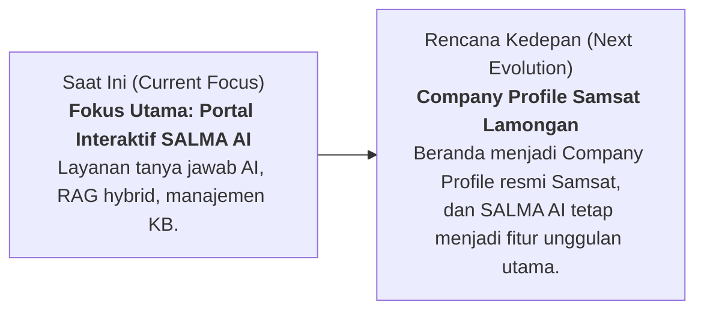
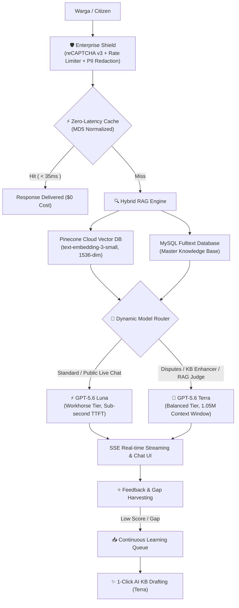

# SALMA AI — SAMSAT LAMONGAN MODERN ASSISTANT
### Enterprise GovTech AI Citizen Service & Hybrid Vector RAG Knowledge Platform

[](https://laravel.com)
[](https://vuejs.org)
[](https://inertiajs.com)
[](https://openai.com)
[](https://pinecone.io)
[](https://developers.google.com/recaptcha)
[](https://web.dev/progressive-web-apps/)

---

## 🏛️ Profil & Tentang SALMA AI

**SALMA** merupakan singkatan resmi dari **SAMSAT LAMONGAN MODERN ASSISTANT**.  
Platform ini dikembangkan sebagai pusat layanan informasi cerdas 24/7 berbasis kecerdasan buatan (*Artificial Intelligence*) untuk melayani seluruh masyarakat Kabupaten Lamongan dan Jawa Timur dalam hal perpajakan daerah, registrasi dan identifikasi kendaraan bermotor, serta kesamsatan.

### 🌟 Visi & Manfaat Utama
- **Layanan Cepat & Akurat**: Menjawab pertanyaan seputar Pajak Kendaraan Bermotor (PKB), SWDKLLJ Jasa Raharja, Bea Balik Nama (BBNKB), perpanjangan STNK 5 tahunan, ganti plat TNKB, hingga jadwal Samsat Keliling dan Payment Point.
- **Transparansi Regulasi & Tarif**: Berlandaskan dasar hukum resmi Pemerintah Provinsi Jawa Timur (**Perda Jatim No. 8 Tahun 2023**, **PP No. 76 Tahun 2020** tentang PNBP Polri, serta SOP Samsat).
- **Aksesibilitas Multi-Kanal**: Tersedia melalui web portal, floating chat widget, Progressive Web App (PWA) yang dapat dipasang di smartphone, dan endpoint integrasi API.

---

## 🗺️ Roadmap & Next Strategic Plan



> [!NOTE]
> **Fokus Halaman Utama (Next Phase)**:  
> Saat ini, halaman utama berfokus penuh pada portal interaktif SALMA AI. Ke depan, halaman beranda (*homepage*) akan dievolusikan menjadi **Company Profile Resmi KB Samsat Lamongan** (informasi visi-misi, pimpinan, galeri layanan, lokasi payment point, jadwal samsat keliling, dan transparansi publik), dengan **SALMA AI** tetap terintegrasi sebagai **Fitur Unggulan Utama (*Flagship Feature*)** di seluruh penjuru platform.

---

## 🧠 Arsitektur AI & Fitur Unggulan



### 1. Multi-Tier AI Model Strategy (OpenAI GPT-5.6 Family)
- **Workhorse Tier (`gpt-5.6-luna`)**:
  - Diterapkan untuk obrolan langsung (*live chat*), streaming SSE, asisten floating widget, dan klasifikasi intensi.
  - Latensi super cepat (*ultra-low Time-To-First-Token*) dengan efisiensi biaya token maksimum.
- **Complex Reasoning Tier (`gpt-5.6-terra`)**:
  - Diterapkan untuk analisis sengketa pajak multi-tahun, *Knowledge Base AI Enhancer*, *Knowledge Gap Auto-Drafting*, dan *RAG Triad Benchmark Judge*.
  - Dilengkapi **1.050.000 Token Context Window** dan **128k output** untuk memproses dokumen Perda Jatim puluhan halaman sekaligus tanpa terpotong.
- **Analytics Tier (`gpt-5.6-luna`)**:
  - Menangani klasterisasi topik, pemeringkatan sentimen, dan ringkasan interaksi harian.

### 2. Hybrid RAG & Vector Database Synchronization
- **Pinecone Vector Database Cloud**: Menggunakan `text-embedding-3-small` (1536 dimensi, cosine similarity metric).
- **Fitur "Fetch Vector DB"**: Sinkronisasi 1-klik untuk menarik dan menyelaraskan 101+ vektor pengetahuan Pinecone langsung ke tabel master MySQL.
- **Interactive "Good Mood" Modal**: Animasi orbital vektor modern, progress bar bertahap, dan tips interaktif seputar layanan Samsat selama proses sinkronisasi.
- **Penyelarasan Skor Kualitas (Exact Pinecone Match)**:
  - Skor disimpan dalam format desimal float (`0.6358`) dan ditampilkan secara presisi dalam persentase satu desimal (**`63.6%`**).
  - Tombol refresh interaktif (`mdi-refresh`) untuk query ulang skor kemiripan vektor secara *real-time*.

### 3. Continuous Learning & Knowledge Gap Harvesting
- **Otomatisasi Penangkapan Gap**: Pertanyaan warga dengan skor kemiripan rendah ($< 0.50$) atau memicu *fallback* otomatis ditangkap ke antrean *Knowledge Gaps*.
- **Agregasi Frekuensi & Klasterisasi**: Mendeteksi pertanyaan yang sering diajukan warga namun belum ada di artikel resmi.
- **1-Click AI KB Generator**: Mengubah gap pertanyaan warga menjadi draf artikel siap publikasi dalam hitungan detik.

### 4. RAG Triad Automated Evaluation Suite
- **Benchmark Mandiri Anti-Halusinasi**: Menilai 3 pilar kualitas RAG:
  1. **Faithfulness**: Mengukur kebenaran jawaban berdasarkan fakta konteks yang disediakan (100% anti-halusinasi).
  2. **Answer Relevance**: Mengukur seberapa tepat jawaban menjawab pertanyaan warga.
  3. **Context Relevance**: Mengukur ketepatan potongan dokumen yang ditarik oleh Pinecone.
- **Golden Dataset**: 10 skenario uji standar regulasi Samsat dalam Bahasa Indonesia dan bahasa Jawa.
- **Command CLI & Admin Dashboard**: Dilengkapi perintah `php artisan rag:evaluate` dan visualisasi dashboard di `/admin/rag-evaluation`.

### 5. Enterprise Shield & Keamanan Tingkat Tinggi
- **Google reCAPTCHA v3 Anti-Spam**: Validasi skor bot tak terlihat ($\ge 0.5$) dengan penyembunyian badge melayang secara legal dan elegan.
- **Multi-Tier Rate Limiting**: Pembatasan 30 request/menit per IP dan 15 request/menit per sesi untuk mencegah *DDoS/spamming*.
- **Redaksi Privasi Warga (PII Masking)**: Otomatis menyensor 16-digit NIK, nomor kartu rekening, dan email pribadi dari logging atau prompt.
- **Filter Prompt Injection & Jailbreak**: Menangkal manipulasi instruksi sistem (*DAN, ignore previous instructions, roleplay bypass*).
- **AI Circuit Breaker**: Proteksi otomatis status failover (`CLOSED` $\rightarrow$ `OPEN` $\rightarrow$ `HALF_OPEN`) saat koneksi OpenAI API mengalami gangguan.

---

## 🛠️ Stack Teknologi

| Layer | Teknologi & Library |
|---|---|
| **Backend** | PHP 8.2+, Laravel 11.x, Laravel Jetstream, MySQL 8.x |
| **Frontend** | Vue.js 3 (Composition API), Inertia.js 2.x, Vuetify 3, Tailwind CSS |
| **AI & Vector DB** | OpenAI API (`gpt-5.6-luna`, `gpt-5.6-terra`, `text-embedding-3-small`), Pinecone Cloud |
| **Security** | Google reCAPTCHA v3, Laravel RateLimiter, PII Redactor, Security Guardrails |
| **Build & Tooling** | Vite 5.x, Rollup, Workbox PWA, Flatpickr, SweetAlert2, Intro.js |

---

## 🚀 Panduan Instalasi & Menjalankan Sistem

### 1. Prasyarat Sistem
- **PHP** >= 8.2 (dengan ekstensi `pdo_mysql`, `curl`, `mbstring`, `openssl`, `fileinfo`)
- **Composer** >= 2.x
- **Node.js** >= 20.x & **NPM**
- **MySQL** >= 8.0

### 2. Langkah Instalasi

1. **Clone Repository**:
   ```bash
   git clone https://github.com/kukuhtri1999/bapenda-ai.git
   cd bapenda-ai
   ```

2. **Install Dependensi Backend & Frontend**:
   ```bash
   composer install
   npm install
   ```

3. **Konfigurasi Environment**:
   Salin `.env.example` menjadi `.env`:
   ```bash
   cp .env.example .env
   ```
   Buka file `.env` dan lengkapi konfigurasi utama:
   ```env
   APP_NAME="SALMA AI"
   APP_URL=http://127.0.0.1:8000

   DB_CONNECTION=mysql
   DB_HOST=127.0.0.1
   DB_PORT=3306
   DB_DATABASE=bapenda_ai
   DB_USERNAME=root
   DB_PASSWORD=

   # OpenAI Configuration (GPT-5.6 Series)
   OPENAI_API_KEY=your_openai_api_key_here
   OPENAI_MODEL=gpt-5.6-luna
   OPENAI_COMPLEX_MODEL=gpt-5.6-terra
   OPENAI_ANALYTICS_MODEL=gpt-5.6-luna
   OPENAI_MAX_TOKENS=4000
   OPENAI_TEMPERATURE=0.7
   OPENAI_CACHE_ENABLED=true
   OPENAI_CACHE_TTL=3600

   # Pinecone Vector Database
   PINECONE_API_KEY=your_pinecone_api_key_here
   PINECONE_ENVIRONMENT=us-east-1-aws
   PINECONE_INDEX_NAME=bapenda-kb
   PINECONE_DIMENSION=1536
   PINECONE_METRIC=cosine

   # Google reCAPTCHA v3 Anti-Spam
   RECAPTCHA_SITE_KEY=your_site_key
   RECAPTCHA_SECRET_KEY=your_secret_key
   RECAPTCHA_ENABLED=true
   RECAPTCHA_MIN_SCORE=0.5
   VITE_RECAPTCHA_SITE_KEY=your_site_key
   ```

4. **Generate Application Key & Migrasi Database**:
   ```bash
   php artisan key:generate
   php artisan migrate --seed
   ```

5. **Sinkronisasi Vektor Pengetahuan (Opsional / Awal)**:
   ```bash
   php artisan kb:fetch-pinecone
   ```

6. **Kompilasi Frontend & Jalankan Server**:
   ```bash
   # Terminal 1: Vite Asset Watcher
   npm run dev

   # Terminal 2: Laravel Development Server
   php artisan serve
   ```
   Akses aplikasi di browser: [http://127.0.0.1:8000](http://127.0.0.1:8000)

---

## 📋 Perintah Artisan Terintegrasi

| Perintah | Deskripsi |
|---|---|
| `php artisan kb:fetch-pinecone` | Menarik seluruh basis pengetahuan dari Pinecone Cloud ke MySQL |
| `php artisan kb:fetch-pinecone --dry-run` | Melakukan simulasi preview sinkronisasi tanpa mengubah database |
| `php artisan rag:evaluate` | Menjalankan evaluasi benchmark otomatis RAG Triad (10 Golden Tests) |
| `php artisan rag:evaluate --limit=5` | Menjalankan pengujian RAG dengan batasan jumlah sampel |
| `php artisan cache:clear` | Membersihkan cache aplikasi dan cache respon cerdas AI |

---

## 📚 Indeks Dokumentasi Teknis

Seluruh dokumentasi rinci atas setiap fase pengembangan tersimpan rapi pada direktori `/documentations`:

1. [Phase 1: Model Tiering & Zero-Latency Response Caching](documentations/2026_08_13_20_28_changes_implementing-phase-1-model-tiering-and-caching.md)
2. [Phase 2: Continuous Learning Queue & Knowledge Gap Harvesting](documentations/2026_08_13_20_33_changes_implementing-phase-2-continuous-learning-and-gaps.md)
3. [Phase 3: Automated RAG Triad Evaluation Benchmark](documentations/2026_08_13_20_52_changes_implementing-phase-3-rag-evaluations-and-scaling.md)
4. [Enterprise Shield: reCAPTCHA v3, Rate Limiting & Circuit Breaker](documentations/2026_08_13_21_11_changes_implementing-recaptcha-anti-spam-and-circuit-breaker.md)
5. [Fetch Vector DB Engine & Deep KB Quality Audit](documentations/2026_08_14_21_18_changes_implementing-fetch-vector-db-and-kb-audit.md)
6. [Pinecone Score Alignment & AI KB Enhancer](documentations/2026_08_14_21_40_changes_aligning-quality-scores-and-gpt5-kb-enhancement.md)
7. [Quality Score Formatter & Floating Chat UX Modernization](documentations/2026_08_14_21_45_changes_fixing-quality-score-display-and-ux-improvements.md)
8. [Migrating to OpenAI GPT-5.6 Luna & GPT-5.6 Terra](documentations/2026_08_15_21_25_changes_migrating-to-gpt56-luna-and-terra.md)

---

## 👨‍💻 Developer & Author

**Kukuh Tri Winarno Nugroho**  
- **LinkedIn**: [Kukuh Tri Winarno Nugroho](https://www.linkedin.com/in/kukuhtri99/)  
- **Website**: [kukuhtri.my.id](https://kukuhtri.my.id/)  
- **GitHub**: [@kukuhtri1999](https://github.com/kukuhtri1999)  

---

© 2026 **SALMA AI — SAMSAT LAMONGAN MODERN ASSISTANT**. Bapenda Provinsi Jawa Timur — KB Samsat Lamongan. All Rights Reserved.
