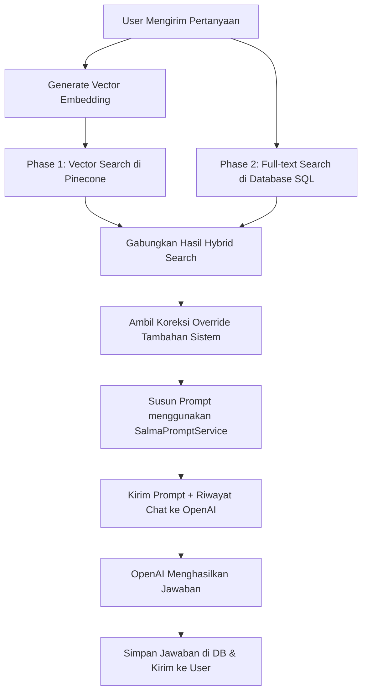

# Dokumentasi Konsep & Mekanisme AI Chat (SALMA AI)

Dokumen ini menjelaskan arsitektur, konsep, dan mekanisme di balik **SALMA AI** (Sistem Asisten Layanan Masyarakat - AI), asisten digital resmi Bapenda Samsat Lamongan, Jawa Timur. Dokumentasi ini disusun dengan bahasa yang mudah dipahami agar dapat menjadi referensi bagi pengembang maupun Agen AI lainnya.

---

## 1. Gambaran Umum Sistem (System Overview)

SALMA AI dirancang untuk membantu masyarakat Lamongan menjawab pertanyaan seputar pajak kendaraan bermotor (PKB), STNK, BPKB, mutasi, balik nama, jadwal Samsat Keliling, lokasi layanan, dan administrasi kendaraan lainnya. 

Secara garis besar, teknologi yang digunakan adalah:
- **Frontend**: Vue 3 + Vuetify (menggunakan Inertia.js untuk komunikasi data yang mulus dengan server tanpa API eksternal yang rumit).
- **Backend**: Laravel (mengatur alur bisnis, database, sesi percakapan, dan integrasi API OpenAI & Pinecone).
- **Database**: SQL (SQLite/MySQL untuk menyimpan riwayat chat) & **Vector Database** (Pinecone untuk pencarian cepat dokumen panduan).
- **AI Core**: OpenAI API (untuk menghasilkan embeddings menggunakan `text-embedding-3-small` dan menyusun jawaban menggunakan model bahasa cerdas seperti `gpt-4o-mini`).

---

## 2. Arsitektur RAG (Retrieval-Augmented Generation)

Agar AI tidak berhalusinasi (mengarang jawaban) dan selalu memberikan jawaban yang **akurat serta resmi**, SALMA AI menggunakan metode **RAG**. 

Metode RAG bekerja dengan cara "mencari dokumen referensi yang relevan terlebih dahulu" dari basis pengetahuan (Knowledge Base) sebelum AI menyusun jawaban untuk pengguna.

### A. Phase 1: Vector Search (Pinecone)
1. Pertanyaan pengguna diubah menjadi vektor (deretan angka matematika) oleh layanan `EmbeddingService` melalui OpenAI Embedding API.
2. Vektor ini dicari di **Pinecone Vector Database** dengan parameter `topK: 15` (mencari 15 potongan dokumen paling mirip).
3. Hanya potongan dokumen dengan tingkat kemiripan (relevance score) **>= 0.30** yang diambil.
4. Sistem membatasi maksimal **5 potongan dokumen dari file yang sama** agar satu dokumen panjang tidak mendominasi seluruh konteks jawaban.

### B. Phase 2: Database Search (SQL Full-text Supplement)
1. Untuk berjaga-jaga apabila pencarian vektor melewati berkas penting, sistem juga menjalankan pencarian teks (full-text search) di database SQL lokal secara bersamaan.
2. Sebelum pencarian, sistem membersihkan kata-kata umum bahasa Indonesia (seperti *saya, di, ke, yang, atau*) agar kata kunci pencarian lebih presisi.
3. Dokumen hasil database SQL yang belum dicakup oleh pencarian vektor akan digabungkan sebagai suplemen/pelengkap referensi.

---

## 3. Alur Percakapan & Penyusunan Jawaban (Message & Chat Flow)

Setiap kali pengguna mengirimkan pesan, backend melakukan koordinasi langkah sebagai berikut:

### 1. Inisialisasi & Log Pesan
Sistem mendeteksi sesi chat (`session_id`). Jika percakapan baru dimulai, sistem membuat baris chat baru dan memicu `generateGreeting()` dari OpenAI. Pesan pengguna disimpan ke dalam tabel `chat_messages` dengan peran (`role`) `'user'`.

### 2. Pengambilan Riwayat Percakapan (Conversation History)
Agar percakapan terasa natural dan AI ingat konteks sebelumnya, sistem mengambil maksimal **6 giliran percakapan terakhir** (`user` dan `assistant`) dari sesi aktif tersebut dan melampirkannya ke dalam request ke OpenAI.

### 3. Klasifikasi Intent Secara Cepat (Intent Detection)
Sistem menggunakan `SalmaPromptService@detectIntent` untuk menebak tujuan pertanyaan pengguna berdasarkan kata kunci reguler (Regex) untuk keperluan analisis statistik, seperti:
- `lokasi_jadwal` (menanyakan lokasi/jadwal Samsat Keliling)
- `prosedur` (menanyakan syarat balik nama, denda, ganti plat)
- `tarif_kalkulasi` (menanyakan nominal biaya atau denda)
- *dan 7 intent lainnya.*

### 4. Pengambilan Override Prioritas Tinggi (`tambahan_sistem`)
Administrator dapat mengunggah pengumuman penting atau koreksi darurat (tipe `tambahan_sistem` di basis pengetahuan, misalnya: *"Samsat Drive Thru tutup sementara tanggal 10 Juni"*). Sistem akan mengambil fakta ini langsung dari database SQL lokal dan menempatkannya di atas dokumen referensi dengan prioritas tertinggi. AI dipaksa untuk mematuhi fakta ini dibanding dokumen basis pengetahuan lainnya.

### 5. Penyusunan Prompt Sistem (`SalmaPromptService`)
Layanan `SalmaPromptService` merangkai instruksi rahasia (System Prompt) yang mengendalikan AI, yang berisi:
- **Identitas**: Siapa SALMA AI (asisten resmi Samsat Lamongan).
- **Alur Berpikir (Chain-of-Thought)**: AI diajarkan untuk menentukan intent, mencocokkan data referensi, memvalidasi angka, dan menyusun jawaban secara logis.
- **Aturan Anti-Halusinasi**: Larangan keras mengarang biaya, jadwal, atau tanggal yang tidak ada di dokumen referensi.
- **Batasan Panjang Respons**: Jawaban lokasi maksimal 80 kata, syarat prosedur maksimal 250 kata, tarif maksimal 150 kata.
- **Penyembunyian Rahasia Internal**: Larangan keras menyebutkan istilah internal seperti *"Knowledge Base"*, *"KB"*, *"Sumber"*, atau *"Blok Data"* kepada pengguna.

### 6. Query OpenAI & Penyimpanan Unik (Inline Storage)
Pesan dikirimkan ke OpenAI untuk menyusun jawaban akhir.
- **Inline Storage Optimization**: Untuk menghemat baris database, balasan dari asisten AI **TIDAK** disimpan di baris database baru. Melainkan disimpan langsung di baris pesan pengguna pada kolom `answer`.
- **Virtual Messages on Frontend**: Saat memuat riwayat chat, backend memformat array data agar pesan yang memiliki `answer` dipecah secara virtual menjadi dua balon pesan berurutan (pesan `user` diikuti pesan `assistant`) sehingga di browser pengguna terlihat seperti chat terpisah.

---

## 4. Keuntungan Arsitektur Ini

1. **Akurasi Tinggi & Tanpa Halusinasi**: AI tidak akan pernah mengarang rute Samsat Keliling atau biaya pajak karena dibatasi secara ketat oleh dokumen referensi di prompt.
2. **Kepatuhan Informasi Terkini**: Adanya fitur `tambahan_sistem` memungkinkan dinas memberikan info/koreksi real-time yang langsung dipatuhi AI.
3. **Efisiensi Database**: Desain penyimpanan inline (`answer` berada di kolom pesan `user`) mengurangi separuh ukuran tabel riwayat chat.
4. **Pencarian Hibrida (Hybrid Search)**: Menggabungkan kecerdasan pencarian vektor (makna kata) dan ketepatan database SQL (kata kunci spesifik) menghasilkan referensi yang sangat lengkap.
