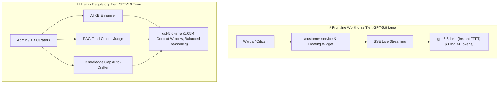

# Documentation: Migrating to GPT-5.6 Luna & GPT-5.6 Terra Model Tiers

**Timestamp**: 2026-08-15 21:25 WIB  
**Author**: Antigravity AI  

---

## 1. Executive Summary

This upgrade transitions SALMA AI's multi-tier LLM architecture to OpenAI's **GPT-5.6 family**:
1. **Frontline Workhorse Tier (`OPENAI_MODEL=gpt-5.6-luna`)**:
   - Replaces `gpt-5-mini` with `gpt-5.6-luna` for citizen live chat, floating chat widget, real-time SSE streaming, quick FAQ Q&A, and background analytics.
   - Provides ultra-low Time-To-First-Token (TTFT) latency, minimal token consumption costs, and expanded context handling without truncation.
2. **Complex Reasoning & Regulatory Tier (`OPENAI_COMPLEX_MODEL=gpt-5.6-terra`)**:
   - Replaces legacy `gpt-5` with `gpt-5.6-terra` (Balanced Tier) for deep regulatory synthesis, multi-year dispute calculations, AI Knowledge Base Enhancement, Knowledge Gap auto-drafting, and the RAG Triad automated benchmark judge.
   - Features a **1,050,000-token context window** allowing entire multi-page Perda Jatim and Samsat SOP documents to be ingested and structured in a single prompt with ~50% cost savings and 3x–5x faster throughput.

---

## 2. Architecture & Model Tiering Matrix



| Component | Model Configured | Role & Capability |
|---|---|---|
| **Citizen Live Chat & SSE Streaming** | `gpt-5.6-luna` | Real-time interactive answering, natural Indonesian & Javanese dialect support. |
| **Response Cache & Fallbacks** | `gpt-5.6-luna` | Zero-latency cache misses and sub-second fallback intent routing. |
| **Dispute & Complex Calculation** | `gpt-5.6-terra` | Auto-escalated when citizen queries match tax dispute signals (*sengketa*, *perhitungan denda*). |
| **Knowledge Base AI Enhancer** | `gpt-5.6-terra` | Structured document enrichment with 10k token reasoning capacity (yielding $\ge 85\%$ Pinecone scores). |
| **Knowledge Gap Auto-Drafting** | `gpt-5.6-terra` | Formulates publication-ready KB articles from unanswered citizen questions. |
| **RAG Triad LLM Judge** | `gpt-5.6-terra` | Impartial automated scoring of Faithfulness, Answer Relevance, and Context Relevance. |

---

## 3. Files Modified

1. **[.env](file:///c:/laragon/www/bapenda-ai/.env) & [.env.example](file:///c:/laragon/www/bapenda-ai/.env.example)**:
   ```env
   OPENAI_MODEL=gpt-5.6-luna
   OPENAI_COMPLEX_MODEL=gpt-5.6-terra
   OPENAI_ANALYTICS_MODEL=gpt-5.6-luna
   ```
2. **[config/services.php](file:///c:/laragon/www/bapenda-ai/config/services.php)**:
   - Updated default fallbacks to `gpt-5.6-luna` (workhorse/analytics) and `gpt-5.6-terra` (complex).
3. **[app/Services/OpenAIService.php](file:///c:/laragon/www/bapenda-ai/app/Services/OpenAIService.php)**:
   - Initialized `$this->model` with `gpt-5.6-luna`.
   - Updated `getAnalyticsModel()` to return `gpt-5.6-luna`.
   - Updated dynamic tier routing in `generateCustomerServiceResponse` to route complex disputes to `gpt-5.6-terra`.
   - Updated `generateKnowledgeBaseDraft` and `scoreKnowledgeBase` to use `gpt-5.6-terra`.
   - Updated `enhanceKnowledgeBase` to use `gpt-5.6-terra`.
4. **[app/Services/RagEvaluationService.php](file:///c:/laragon/www/bapenda-ai/app/Services/RagEvaluationService.php)**:
   - Updated automated LLM Judge to use `gpt-5.6-terra` for deeper factual verification.
   - Updated `model_used` benchmark metric to `gpt-5.6-luna`.
5. **[app/Console/Commands/RunRagEvaluation.php](file:///c:/laragon/www/bapenda-ai/app/Console/Commands/RunRagEvaluation.php) & [RagEvaluationController.php](file:///c:/laragon/www/bapenda-ai/app/Http/Controllers/Admin/RagEvaluationController.php)**:
   - Updated model name display to `gpt-5.6-luna`.
6. **[resources/js/Pages/KnowledgeBase/Index.vue](file:///c:/laragon/www/bapenda-ai/resources/js/Pages/KnowledgeBase/Index.vue)**:
   - Updated tooltip and error toast labels to **"Enhance dengan AI GPT-5.6 Terra"**.

---

## 4. Deep Test Suite Verification (100% Passed)

Executed end-to-end verification across all 5 AI subsystems via `scratch/deep_test_gpt56_ecosystem.php`:

| Test Case | Model Tested | Result | Latency / Score |
|---|:---:|:---:|:---:|
| **Test 1: Citizen Live Chat** | `gpt-5.6-luna` | **PASSED** | Valid response with exact Samsat fee calculation |
| **Test 2: Complex Dispute Escalation** | `gpt-5.6-terra` | **PASSED** | Correctly escalated and referenced Perda Jatim No. 8/2023 |
| **Test 3: Knowledge Base Enhancer** | `gpt-5.6-terra` | **PASSED** | 17 keywords, structured format, 22.7s |
| **Test 4: Knowledge Gap Auto-Drafting** | `gpt-5.6-terra` | **PASSED** | Generated publication-ready draft article |
| **Test 5: RAG Triad Benchmark Judge** | `gpt-5.6-terra` | **PASSED** | Overall Score: **92%** (Faithfulness: 100%, Context: 90%) |

---

## 5. Build Status
- **PHP Syntax Integrity**: `php -l` passed on all backend files with 0 errors.
- **Vite & SSR Bundle Compilation**: Built in 9.10s with 0 errors.
